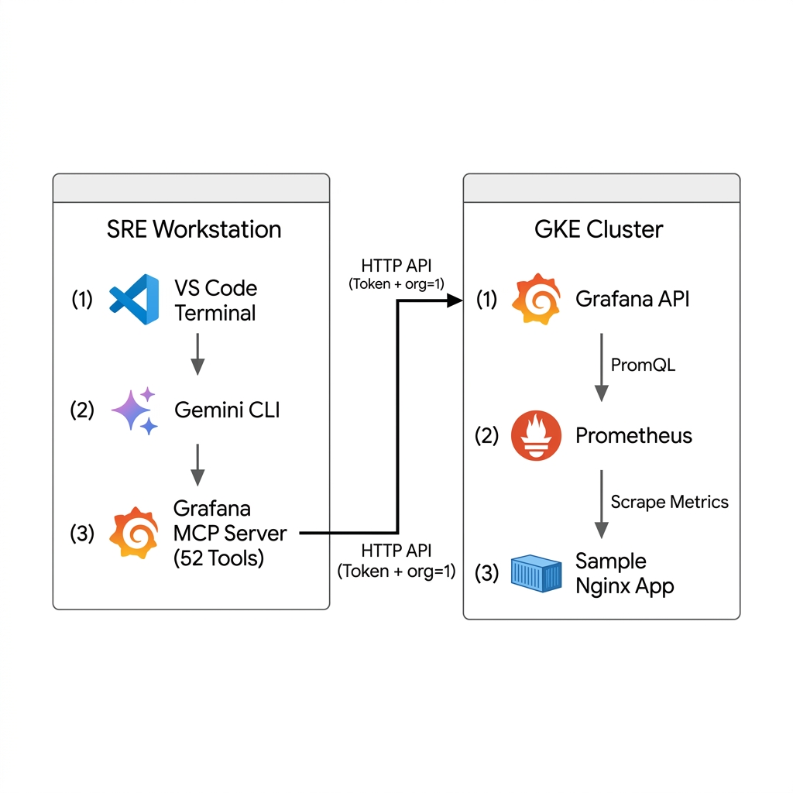
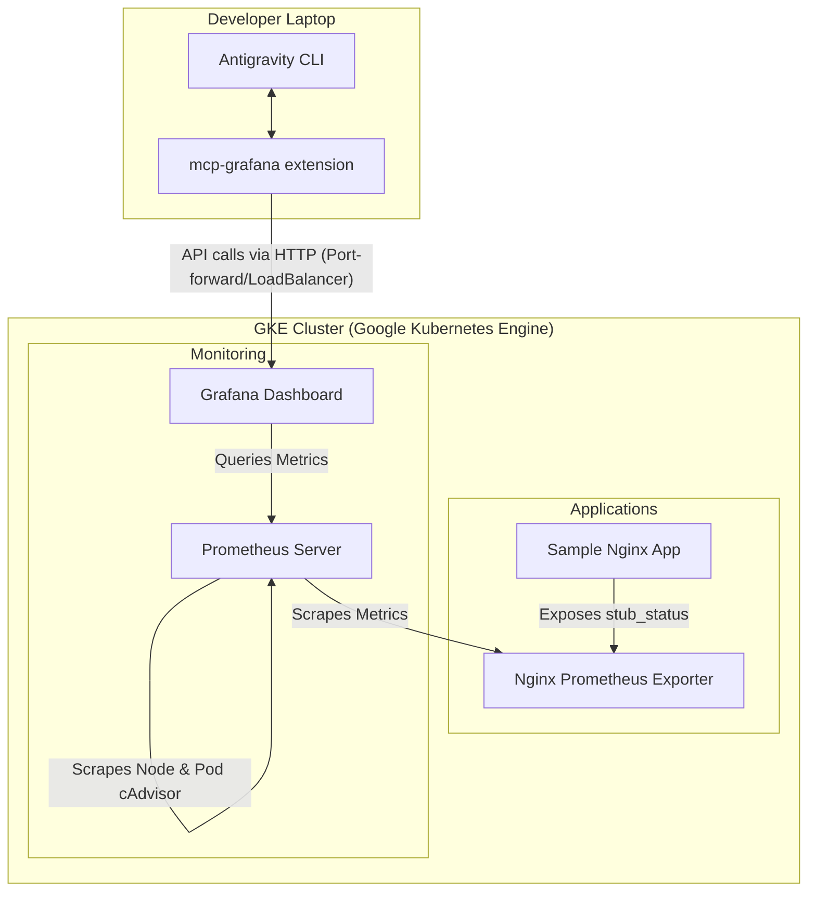

# AI-Powered Observability on GKE: Query Grafana with Antigravity CLI & MCP Extensions

[](#)
[](#)
[](#)
[](#)

> **📍 Presented at GrafanaCon by [Sanket Bisne](https://github.com/sanketbisne)** — Cloud / DevOps / Platform Engineer

## 💡 What is this?

Ever wished you could just *ask* your monitoring system what's going on instead of clicking through dashboards? That's exactly what this project does.

This repo sets up a complete **Kubernetes observability stack** (Prometheus + Grafana) on **Google Kubernetes Engine (GKE)** and connects it to **Antigravity CLI** — Google's AI-powered command-line tool. Using the [Grafana MCP Server](https://github.com/grafana/mcp-grafana) extension, you can talk to your dashboards, query metrics, and even create new dashboards — all through **natural language** in your terminal.

### What can you do with it?

| Instead of... | You just type... |
|---|---|
| Opening Grafana UI → navigating to dashboards → finding the right panel | *"List all my Grafana dashboards"* |
| Writing PromQL queries manually in the Grafana explore tab | *"Show me CPU usage of all pods in the last 15 minutes"* |
| Clicking through the UI to build a new dashboard | *"Create a dashboard for Nginx request metrics"* |
| Checking who's on-call in Grafana OnCall | *"Who is currently on-call?"* |

### Key Technologies

| Technology | Role |
|---|---|
| **Google Kubernetes Engine (GKE)** | Hosts the entire observability stack |
| **Prometheus** | Collects and stores metrics from Kubernetes nodes, pods, and applications |
| **Grafana** | Visualizes metrics through dashboards and provides the API surface |
| **Antigravity CLI** | AI-powered terminal that understands natural language commands |
| **Grafana MCP Server** | The bridge — translates Antigravity's intent into Grafana API calls (52+ tools) |

---


## 🏗️ Architecture Overview

The demo environment consists of a fully-provisioned observability sandbox running inside GKE:





### Sandbox Components
1. **Sample App ([sample-app.yaml](file:///Users/sanketbisne/k8s/sample-app.yaml))**: An Nginx container with a sidecar Nginx Prometheus Exporter that exposes server-level metrics (`/nginx_status`).
2. **Prometheus ([prometheus.yaml](file:///Users/sanketbisne/k8s/prometheus.yaml))**: Automatically scrapes cluster-wide cAdvisor metrics (CPU, Memory) as well as any pods marked with Prometheus annotations.
3. **Grafana ([grafana.yaml](file:///Users/sanketbisne/k8s/grafana.yaml))**: Pre-configured with a Prometheus datasource and a pre-loaded **Kubernetes Resource Usage** dashboard showcasing pod-level CPU and memory graphs.

---

## 🚀 Quickstart: Deployment on GKE

Follow these steps to deploy the entire stack to your Google Kubernetes Engine (GKE) cluster.

### Prerequisites
* A running **GKE Cluster**
* **kubectl** configured to access your cluster
* **Antigravity CLI** installed on your workstation
* Grafana access token with Admin privileges

---

### Step 1: Deploy Prometheus Server
Prometheus acts as the time-series database. It is configured with ClusterRole permissions to discover nodes, pods, and services dynamically.

```bash
kubectl apply -f prometheus.yaml
```

*This deploys:*
* ServiceAccount, ClusterRole, and ClusterRoleBinding for Kubernetes service discovery.
* A ConfigMap containing the scrape configurations.
* A single-replica deployment running Prometheus `v2.45.0`.
* A cluster IP service mapping port `9090`.

---

### Step 2: Deploy Grafana
Grafana is pre-provisioned with the Prometheus data source and an interactive Kubernetes resource usage dashboard.

```bash
kubectl apply -f grafana.yaml
```

*This deploys:*
* Grafana ConfigMaps for automatic provisioning of the data source and the Kubernetes dashboard.
* A deployment running Grafana `10.0.0` with anonymous Admin access enabled (ideal for demos).
* A `LoadBalancer` service exposing Grafana externally on port `80`.

---

### Step 3: Deploy the Sample Nginx Application
A workload to generate telemetry data and test scraping capabilities.

```bash
kubectl apply -f sample-app.yaml
```

*This deploys:*
* An Nginx deployment with a ConfigMap setting up `nginx.conf` and exposing `/nginx_status`.
* A sidecar container running `nginx-prometheus-exporter` on port `9113`.
* A standard Kubernetes service targeting port `80`.

---

### Step 4: Verify Deployments
Ensure all pods are in a `Running` state:

```bash
kubectl get pods
```

Retrieve the external IP of the Grafana service to access the dashboard and use it for Antigravity CLI setup:

```bash
kubectl get svc grafana -w
```

---

## 🤖 Integrating Antigravity CLI with Grafana (MCP)

To enable conversational observability, you will install the official Grafana Model Context Protocol (MCP) server directly inside the Antigravity CLI. This allows Antigravity to invoke APIs under the hood when you ask questions about dashboards, panels, and metrics.

### 🔌 Installation
Run the following installation command in your terminal where Antigravity CLI is installed:

```bash
curl -fsSL https://antigravity.google/cli/install.sh | bash
agy extension install https://github.com/grafana/mcp-grafana
```

During installation, Antigravity CLI will prompt you for three configuration values:

| Prompt | What to Enter | Example |
|---|---|---|
| **Grafana URL** | The external IP or URL of your Grafana service | `http://34.172.90.124` |
| **Service Account Token** | A Grafana API token (see below how to create one) | `glsa_Qn1Qc5Xv...` |
| **Organization ID** | The Grafana org to target | `1` |

---

### 🔑 Step A: Generate a Grafana Service Account Token

Before Antigravity CLI can talk to your Grafana instance, you need to create an API token. Follow these steps inside the **Grafana UI**:

1. **Open Grafana** in your browser using the external IP:
   ```
   http://<EXTERNAL_IP>
   ```
2. Navigate to **Administration** (gear icon in the left sidebar) → **Service Accounts**
3. Click **"Add service account"**
   - **Display name**: `agy-cli`
   - **Role**: `Admin` (required for creating dashboards and full access)
4. Click **"Create"**
5. On the service account page, click **"Add service account token"**
   - **Token name**: `agy-mcp-token`
   - **Expiration**: Set as needed (or "No expiration" for demos)
6. Click **"Generate token"**
7. **Copy the token immediately** — it starts with `glsa_` and will only be shown once:
   ```
   glsa_YOUR_SERVICE_ACCOUNT_TOKEN_HERE
   ```

> [!CAUTION]
> The token is only displayed **once**. If you lose it, you'll need to generate a new one. Never commit tokens to version control.

---

### 📂 Understanding the Extension Directory

After running `curl -fsSL https://antigravity.google/cli/install.sh | bash
agy extension install`, all extension files are stored locally on your machine at:

```
~/.agy/extensions/grafana/
```

Here's what each file does:

```
~/.agy/extensions/grafana/
├── .env                              # Your credentials (URL, token, org ID)
├── .agy-extension-install.json    # Tracks the install source & version
├── gemini-extension.json             # Extension manifest (defines MCP server config)
└── mcp-grafana                       # The actual MCP server binary (compiled Go)
```

#### `.env` — Your Authentication Credentials
This is where Antigravity CLI stores the connection details you entered during setup:

```env
GRAFANA_URL=http://34.172.90.124
GRAFANA_SERVICE_ACCOUNT_TOKEN=glsa_YOUR_SERVICE_ACCOUNT_TOKEN_HERE
GRAFANA_ORG_ID=1
```

> [!TIP]
> If you need to update your Grafana URL or rotate the token, simply edit this `.env` file directly at `~/.agy/extensions/grafana/.env`. No re-installation needed.

#### `gemini-extension.json` — Extension Manifest
This file defines the MCP server configuration and the three settings Antigravity prompts for during install:

```json
{
  "name": "grafana",
  "version": "0.7.0",
  "mcpServers": {
    "grafana": {
      "command": "${extensionPath}${/}mcp-grafana"
    }
  },
  "settings": [
    {
      "name": "Grafana URL",
      "envVar": "GRAFANA_URL",
      "required": true
    },
    {
      "name": "Service Account Token",
      "envVar": "GRAFANA_SERVICE_ACCOUNT_TOKEN",
      "required": true,
      "sensitive": true
    },
    {
      "name": "Organization ID",
      "envVar": "GRAFANA_ORG_ID"
    }
  ]
}
```

#### `mcp-grafana` — The MCP Server Binary
This is the compiled Go binary (from [grafana/mcp-grafana](https://github.com/grafana/mcp-grafana) release `v0.14.0`) that Antigravity CLI launches as a local subprocess. When you type a natural language query, Antigravity translates it into a tool call, and this binary executes the corresponding Grafana HTTP API request using your credentials from `.env`.

---

## 🔍 Inspecting MCP Extension Capabilities

Once the extension is installed, you can query and inspect the active tools in your Antigravity session.

### Running `/mcp list` or `mcp list`
Typing `mcp list` in the Antigravity CLI will display all connected MCP Servers and their respective toolsets. When configured with Grafana, you will see a dynamic output similar to:

```text
✦ I have access to several Model Context Protocol (MCP) servers that extend my capabilities. Here is a summary of the available toolsets:

  1. Google Cloud Run (mcp_cloud-run)
     Allows for management and deployment of services on Google Cloud.
  
  2. GitHub (mcp_github)
     Comprehensive repository management and collaboration.

  3. Grafana (mcp_grafana)
     Observability and incident management tools:
      * Dashboards & Panels: Search, retrieve, and update dashboards; render panels as images.
      * Alerting: Manage alert rules and notification routing.
      * OnCall & Incidents: Manage incidents, schedules, shifts, and on-call users.
      * Data Queries: Query Prometheus (PromQL), Loki (LogQL), Pyroscope, and Tempo.
      * Sift: Perform automated investigations for error patterns and slow requests.
```

If you query details about active tools using `/mcp list`, it reveals the **52 high-fidelity tools** available on the Grafana server:

```text
🟢 grafana (from grafana) - Ready (52 tools)
  Tools:
  - mcp_grafana_add_activity_to_incident
  - mcp_grafana_alerting_manage_routing
  - mcp_grafana_alerting_manage_rules
  - mcp_grafana_create_annotation
  - mcp_grafana_create_folder
  - mcp_grafana_create_incident
  - mcp_grafana_find_error_pattern_logs
  - mcp_grafana_find_slow_requests
  - mcp_grafana_generate_deeplink
  - mcp_grafana_get_alert_group
  - mcp_grafana_get_annotation_tags
  - mcp_grafana_get_annotations
  - mcp_grafana_get_assertions
  - mcp_grafana_get_current_oncall_users
  - mcp_grafana_get_dashboard_by_uid
  - mcp_grafana_get_dashboard_panel_queries
  - mcp_grafana_get_dashboard_property
  - mcp_grafana_get_dashboard_summary
  - mcp_grafana_get_datasource
  - mcp_grafana_get_incident
  - mcp_grafana_get_oncall_shift
  - mcp_grafana_get_panel_image
  - mcp_grafana_get_plugin
  - mcp_grafana_get_sift_analysis
  - mcp_grafana_get_sift_investigation
  - mcp_grafana_grafana_api_request
  - mcp_grafana_list_alert_groups
  - mcp_grafana_list_datasources
  - mcp_grafana_list_incidents
  - mcp_grafana_list_loki_label_names
  - mcp_grafana_list_loki_label_values
  - mcp_grafana_list_oncall_schedules
  - mcp_grafana_list_oncall_teams
  - mcp_grafana_list_oncall_users
  - mcp_grafana_list_prometheus_label_names
  - mcp_grafana_list_prometheus_label_values
  - mcp_grafana_list_prometheus_metric_metadata
  - mcp_grafana_list_prometheus_metric_names
  - mcp_grafana_list_pyroscope_label_names
  - mcp_grafana_list_pyroscope_label_values
  - mcp_grafana_list_pyroscope_profile_types
  - mcp_grafana_list_sift_investigations
  - mcp_grafana_query_loki_logs
  - mcp_grafana_query_loki_patterns
  - mcp_grafana_query_loki_stats
  - mcp_grafana_query_prometheus
  - mcp_grafana_query_prometheus_histogram
  - mcp_grafana_query_pyroscope
  - mcp_grafana_search_dashboards
  - mcp_grafana_search_folders
  - mcp_grafana_update_annotation
  - mcp_grafana_update_dashboard
```

---

## 🛡️ SRE Security: The Interactive Consent UI

One of the key security pillars in Antigravity CLI is its **explicit human-in-the-loop consent mechanism**. Antigravity will never run a destructive or analytical action against your live systems without asking.

When you ask Antigravity CLI to run an observation command:
> *"List my Grafana dashboards"*

The CLI intercepts the matching MCP tool (`list_datasources` or `search_dashboards`) and presents a visual consent modal in the terminal:

```text
╭─────────────────────────────────────────────────────────────────────────────────────────────────────────────────╮
│ Action Required                                                                                                 │
│                                                                                                                 │
│ ?  list_datasources (grafana MCP Server) {}                                                                     │
│                                                                                                                 │
│ MCP Server: grafana                                                                                             │
│ Tool: list_datasources                                                                                          │
│                                                                                                                 │
│ Allow execution of MCP tool "list_datasources" from server "grafana"?                                           │
│                                                                                                                 │
│ ● 1. Allow once                                                                                                 │
│   2. Allow tool for this session                                                                                │
│   3. Allow all server tools for this session                                                                    │
│   4. No, suggest changes (esc)                                                                                  │
╰─────────────────────────────────────────────────────────────────────────────────────────────────────────────────╯
```

This security mechanism gives operators full control over the execution scope: from single-time execution (`Allow once`) to full-session automation (`Allow all server tools for this session`).

---

## 🧠 SRE Agent Intelligence: Local Workspace Awareness & Fallback

A standout feature of Antigravity CLI is **contextual local workspace awareness**. If the live Grafana connection encounters issues (e.g. invalid credentials, networking problems, or a `401 Unauthorized` token error), the agent does not just crash or show a blank screen.

### Real-World Demo Scenario: Gracious API Token Fallback
If the live connection fails:

```text
  Listing Dashboards: Searching for all Grafana dashboards to provide a list to the user.

  ✓  ReadFile  grafana.yaml

✦ The attempt to list dashboards from your Grafana instance failed with a 401 Unauthorized error (invalid API key). 
  This indicates that the Grafana MCP server is not correctly authenticated with your Grafana instance.

  However, I found a dashboard definition in your local grafana.yaml file:

  Kubernetes Resource Usage (uid: k8s-resources)
  This dashboard is pre-provisioned via a ConfigMap and includes the following panels:
   * CPU Usage by Pod: sum(rate(container_cpu_usage_seconds_total{container!=""}[5m])) by (pod)
   * Memory Usage by Pod: sum(container_memory_working_set_bytes{container!=""}) by (pod)
```

**Why this is a killer talking point at GrafanaCon:**
* **Local Parsing**: The agent autonomously notices `grafana.yaml` in the user's open files or active workspace directory.
* **Intelligent Synthesis**: It parses the ConfigMap inside `grafana.yaml`, extracts the JSON definition of the dashboard (`Kubernetes Resource Usage` with UID `k8s-resources`), identifies the metric panels, and serves the user with the PromQL expressions directly.
* **Hybrid Operation**: This demonstrates how Antigravity blends live runtime connections with local code context for an uninterrupted SRE workspace experience.

---

## 🎙️ The Live Demo Storyline: SRE Step-by-Step Flow

When presenting this live demo at **GrafanaCon**, this is the narrative flow that demonstrates the end-to-end synergy between the user, Antigravity CLI, the local MCP extension, and GKE observability:


### 1. The SRE Laptop Setup
An operator opens their laptop, opens the terminal, and starts a conversational session by running:
```bash
agy
```

```text
      ▄▀▀▄        Antigravity CLI 1.0.2
     ▀▀▀▀▀▀       sanketbisne@gmail.com (Google AI Pro)
    ▀▀▀▀▀▀▀▀      Gemini 3.5 Flash (Medium)
   ▄▀▀    ▀▀▄     ~/k8s
  ▄▀▀      ▀▀▄

> /mcp
  ⎿  Restarted server: cloud-run

> /mcp
  ⎿  Restarted server: grafana

────────────────────────────────────────────────────────────
> list my grafana dashboard

● ListDir(/Users/sanketbisne/.gemini/antigravity-cli/mcp/grafana) 
● Read(/Users/sanketbisne/.gemini/antigravity-cli/mcp/grafana/list_dashboards.json) 
● grafana/list_dashboards(List Grafana dashboards) (ctrl+o to expand)

  Here is your Grafana dashboard:

  • Title: Kubernetes Resource Usage
  • UID:  k8s-resources 
  • ID:  1 
  • URL Path:  /d/k8s-resources/kubernetes-resource-usage 
```

This opens the interactive **Antigravity CLI** workspace, acting as the centralized command center for operations.

### 2. Installing the Grafana Extension (Local MCP Host)
To hook Antigravity up to Grafana, the presenter runs:
```bash
curl -fsSL https://antigravity.google/cli/install.sh | bash
agy extension install https://github.com/grafana/mcp-grafana
```
* **Under the hood**: This single command downloads, configures, and initializes the **Grafana MCP Server** locally on the SRE's laptop. The extension acts as a translator between Antigravity's LLM reasoning and the Grafana API surface.

### 3. Firing Natural Language Commands
With the session active, the presenter types natural language commands directly into the terminal, such as:
* *“List my dashboards.”*
* *“Create a new dashboard for CPU and memory utilization.”*

### 4. Antigravity CLI as the Intelligent Orchestrator
When the SRE hits `Enter`:
1. **Intent Parsing**: The Antigravity CLI processes the request and determines what the SRE wants to achieve.
2. **Tool Selection**: Antigravity scans its active MCP directory and dynamically selects which of the **52 Grafana MCP tools** to invoke (e.g. mapping *“List my dashboards”* to `mcp_grafana_search_dashboards`).
3. **Local Execution**: The CLI calls the target tool on the locally running Grafana MCP Server.

### 5. API Gateway & Scraper Retrieval
The local MCP server securely forwards the request over HTTP (using your configured credentials and `org=1`) to the **Grafana API** running in GKE. 
* To resolve queries like pod resource usage, Grafana fetches live metrics from **Prometheus**, which scrapes node-level and pod-level data inside the cluster.

### 6. Terminal Presentation
The retrieved data or success confirmation flows back from Grafana to the local MCP server, which returns it to the Antigravity CLI. Antigravity then processes the raw JSON payload and prints it as a highly polished, human-readable markdown table directly in the SRE's active terminal.

---

## 🎭 Live Demo Walkthrough: Conversational Observability

Use these highly interactive scenarios during the GrafanaCon presentation to showcase real-world workflows.

### Scenario A: Dashboard Discovery & Inspection
Instead of manually navigating the UI, ask Antigravity to inspect your Grafana instance.

| SRE Natural Language Query | What Antigravity Does Behind the Scenes (MCP Tools) |
|---|---|
| *"What dashboards are currently configured in my Grafana instance?"* | Invokes `mcp_grafana_search_dashboards` to fetch the metadata of all loaded boards. |
| *"Describe the panels inside the 'Kubernetes Resource Usage' dashboard."* | Invokes `mcp_grafana_get_dashboard_by_uid` with UID `k8s-resources` to outline the panels ("CPU Usage by Pod", "Memory Usage by Pod"). |
| *"What are the Prometheus data sources available?"* | Invokes `mcp_grafana_list_datasources` to confirm connection configurations. |

---

### Scenario B: Diagnostic Reasoning & Metrics Scraper Check
Let Antigravity analyze your actual Kubernetes targets:

1. **Ask Antigravity for a high-level status of CPU utilization:**
   > *"Run a PromQL query on my datasource to check the CPU usage of our pods."*
2. **Dynamic Querying:**
   > *(Antigravity CLI invokes `mcp_grafana_query_prometheus` using the expression parsed from your local configuration: `sum(rate(container_cpu_usage_seconds_total{container!=""}[5m])) by (pod)` and reports the live utilization metrics in clean markdown tables.)*
3. **Follow-up Memory Query:**
   > *"Now run a query to show me the current memory working set of the 'sample-app' pods."*

---

## 🛠️ Customization & Extensibility

* **Adding custom metrics**: You can modify the metrics dashboard in [grafana.yaml](file:///Users/sanketbisne/k8s/grafana.yaml) under the ConfigMap `grafana-dashboard-k8s`.
* **Updating Prometheus scrape jobs**: Edit [prometheus.yaml](file:///Users/sanketbisne/k8s/prometheus.yaml) under the `prometheus-server-conf` ConfigMap to add custom rules or scrape jobs for additional microservices.

---

> [!TIP]
> **For the Live Demo at GrafanaCon:** Make sure to port-forward Prometheus (`kubectl port-forward svc/prometheus-service 9090:9090`) and Grafana (`kubectl port-forward svc/grafana 3000:80`) if you are running on a local cluster like Minikube, or use the `LoadBalancer` external IP on GKE for seamless external access.

### Scenario C: Generative Dashboard Creation (The "Wow" Factor)
Show off the power of LLM reasoning by asking Antigravity to build a complex dashboard from scratch using natural language.

1. **Dashboard as Code (Local Context)**
   If you want Antigravity to modify your local `grafana.yaml` file instead of hitting the live API:
   > *"Create a new Grafana dashboard titled 'Golden Signals: Sample App'. I want it to contain 3 panels measuring the health of our 'sample-app' pods. Panel 1 should be a timeseries showing the rate of CPU usage over the last 5 minutes. Panel 2 should be a gauge showing current memory working set bytes. Panel 3 should be a stat panel showing the filesystem usage. Use the 'Prometheus' datasource for all panels."*

2. **Live API Creation (MCP Tooling)**
   If you want to bypass local files and force the agent to use the `update_dashboard` MCP tool to create it live:
   > *"Use the Grafana MCP extension tool to create a new dashboard titled 'Live System Health'. Add a panel showing overall CPU usage using the Prometheus datasource. IMPORTANT: Do NOT modify any local files or YAML configs. You must use the `update_dashboard` MCP API tool directly to push this to the Grafana server."*

---

### Scenario D: On-the-fly Image Rendering & Sharing
Show how to quickly share visual insights without opening the browser.

> *"Fetch a rendered PNG image of the 'Kubernetes Resource Usage' dashboard for the last 1 hour and show it to me here."*
> *"Generate a deep link to the 'Sample App Resource Usage' dashboard so I can drop it in Slack."*

---

### Scenario E: Troubleshooting Scenarios
Act like there is a problem and see how the AI responds and correlates data.

> *"My sample-app seems slow. Can you check the Prometheus metrics and the Grafana dashboards to see if there are any CPU spikes or memory leaks?"*

---

## Quick Copy-Paste Prompts

What dashboards are currently configured in my Grafana instance?

Describe the panels inside the 'Kubernetes Resource Usage' dashboard. What exactly is it measuring?

Run a PromQL query on my datasource to check the CPU usage of our pods.

Now run a query to show me the current memory working set of the 'sample-app' pods.

Create a new Grafana dashboard titled 'Golden Signals: Sample App'. I want it to contain 3 panels measuring the health of our 'sample-app' pods. Panel 1 should be a timeseries showing the rate of CPU usage over the last 5 minutes. Panel 2 should be a gauge showing current memory working set bytes. Panel 3 should be a stat panel showing the filesystem usage. Use the 'Prometheus' datasource for all panels.

My sample-app seems slow. Can you check the Prometheus metrics and the Grafana dashboards to see if there are any CPU spikes or memory leaks?